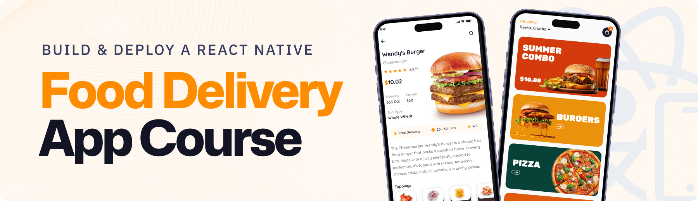

<div align="center">
  <br />
    <a href="https://www.youtube.com/watch?v=LKrX390fJMw" target="_blank">
      
    </a>
  <br />

  <div>
    
    
        
    
    
  </div>

  <h2 align="center">🍔 Food Delivery Mobile App</h2>

  <p align="center">
    A modern, full-stack food delivery app built with React Native, Expo, TailwindCSS, and Appwrite.  
    Smooth UI, scalable backend, and a clean developer experience — all in one.
  </p>
</div>

## 📋 <a name="table">Table of Contents</a>

1. 🤖 [Introduction](#introduction)
2. ⚙️ [Tech Stack](#tech-stack)
3. 🔋 [Features](#features)
4. 🤸 [Quick Start](#quick-start)
5. 📞 [Contacts](#contacts)
6. 🚀 [Show Your Support](#show-your-support)


## <a name="introduction">🤖 Introduction</a>

Built with React Native, TypeScript, and Tailwind CSS, this full-stack Food Delivery app features Google Authentication, dynamic search and filters, cart functionality, and smooth navigation. Powered by Appwrite for backend, database, and file storage, it delivers a responsive, scalable, and intuitive user experience with modern UI/UX best practices.

The goal? **A scalable, user-friendly app with modern UI/UX best practices**.


## <a name="tech-stack">⚙️ Tech Stack</a>

- **[Appwrite](https://jsm.dev/rn25-restate)** is an open-source backend-as-a-service platform offering secure authentication (email/password, OAuth, SMS, magic links), databases, file storage with compression/encryption, real-time messaging, serverless functions, and static site hosting via Appwrite Sites—all managed through a unified console and microservices architecture.

- **[Expo](https://expo.dev/)** is an open-source platform for building universal native apps (Android, iOS, web) using JavaScript/TypeScript and React Native. It features file-based routing via Expo Router, fast refresh, native modules for camera/maps/notifications, over-the-air updates (EAS), and streamlined app deployment.

- **[NativeWind](https://www.nativewind.dev/)** brings Tailwind CSS to React Native and Expo, allowing you to style mobile components using utility-first classes for fast, consistent, and responsive UI design.

- **[React Native](https://reactnative.dev/)** is a framework for building mobile UIs with React. It enables component‑based, cross-platform development with declarative UI, deep native API support, and is tightly integrated with Expo for navigation and native capabilities.

- **[Tailwind CSS](https://tailwindcss.com/)** is a utility-first CSS framework enabling rapid UI design via low-level classes. In React Native/Expo, it’s commonly used with NativeWind to apply Tailwind-style utilities to mobile components.

- **[TypeScript](https://www.typescriptlang.org/)** is a statically-typed superset of JavaScript providing type annotations, interfaces, enums, generics, and enhanced tooling. It improves error detection, code quality, and scalability—ideal for robust, maintainable projects.

- **[Zustand](https://github.com/pmndrs/zustand)** is a minimal, hook-based state management library for React and React Native. It lets you manage global state with zero boilerplate, no context providers, and excellent performance through selective state subscriptions.

- **[Sentry](https://jsm.dev/rn-food-sentry)** is a powerful error tracking and performance monitoring tool for React Native apps. It helps you detect, diagnose, and fix issues in real-time to improve app stability and user experience.

## 🎨 UI/UX Design

The entire interface of **Food Ordering App** was meticulously crafted using **Figma**, focusing on a smooth and intuitive food-booking experience. Every screen—from onboarding to payment—follows a clean, modern, and user-friendly design system.

<p align="center">
  <a href="https://www.figma.com/design/FGHC0TYI24OH28CgTu4VZx/Food-Delivery-App?node-id=0-1&t=B938Im9U84TKMYmd-1" target="_blank">
    
  </a>
</p>

> ✨ Built with attention to detail for a seamless user journey on both Android and iOS platforms.

---

## <a name="features">🔋 Features</a>

👉 **Google Authentication**: Secure and seamless user sign-ins using Google.  

👉 **Home Page**: Showcases the latest offers and directs users to filtered search results.  

👉 **Search Page**: Lets users explore all foods with category filters and keyword search.  

👉 **Product Details Page**: Displays food images, key details, and allows adding items to the cart.  

👉 **Cart Page**: Review selected items and see the total price.  

👉 **Profile Page**: Manage user settings and preferences.  

👉 **Appwrite Integration**: Handles backend database and file storage for food items.

and many more, including code architecture and reusability.


## <a name="quick-start">🤸 Quick Start</a>

Follow these steps to set up the project locally on your machine.

**Prerequisites**

Make sure you have the following installed on your machine:

- **[Git](https://git-scm.com/)**
- **[Node.js](https://nodejs.org/en)**
- **[npm](https://www.npmjs.com/)** _(Node Package Manager)_

**Cloning the Repository**

```bash
git https://github.com/Itssanthoshhere/Food-Delivery-App.git
cd Food-Delivery-App
```

**Installation**

Install the project dependencies using npm:

```bash
npm install
```

**Set Up Environment Variables**

Create a new file named `.env` in the root of your project and add the following content:

```env
EXPO_PUBLIC_APPWRITE_PROJECT_ID=
EXPO_PUBLIC_APPWRITE_ENDPOINT=
```

Get credentials from your **[Appwrite Dashboard](https://appwrite.io/)**.


**Running the Project**

```bash
npx expo start
```

Open your ExpoGO app on your phone and scan the QR code to view the project.

---

## 🙌 Special Thanks

Inspired by **JavaScript Mastery’s** tutorials, but built with my own improvements, custom UI, and bug fixes.

---

## <a name="contacts">🔗 Contacts</a>

Feel free to connect with me:

* GitHub: [Itssanthoshhere](https://github.com/Itssanthoshhere)
* LinkedIn: [Santhosh VS](https://www.linkedin.com/in/thesanthoshvs/)

---

## ⭐️ Show Your Support

If you liked this project, drop a ⭐ on the repo and share it with others!


